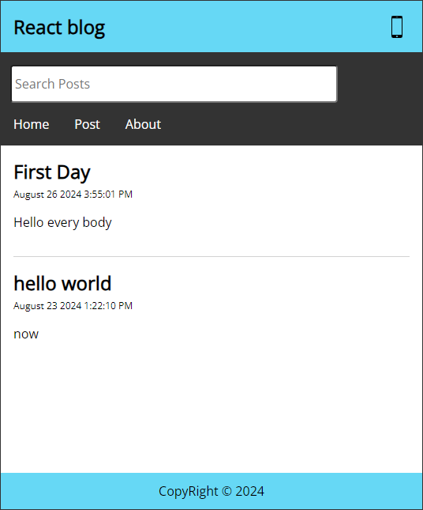

# Basic Blog Application
This project is a simple blog application where users can create, edit, and manage posts. The primary focus of this application is learn React,  Basic of Axios and  React Router

  the final version of this project can find in [CustomHooksBranch](https://github.com/ubeysaab/ReactBlog/tree/customHooks)

## New Errors I get while developing this project 

- New Error I get  is Cannot destructure property 'basename' of 'React2.useContext(...)' as it is null 

 The Reason is "<Link> "looks like it’s trying to access the context of the Router, and isn’t finding it because it out of it .
 <!-- this because navBar component was outside the BrowserRoute. -->
  <!-- the same thing happen when i try to use useNavigate on views so i moved the browserrouter to the app.jsx -->

